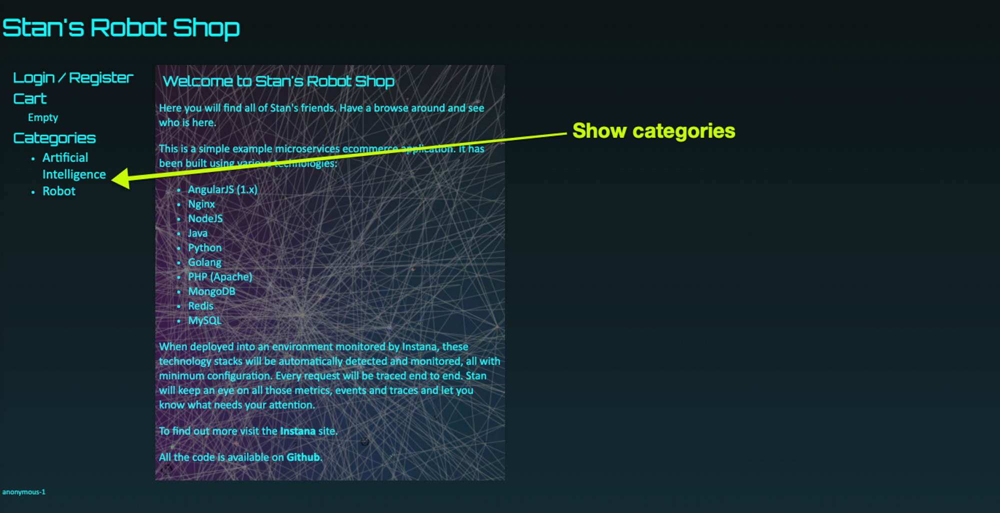
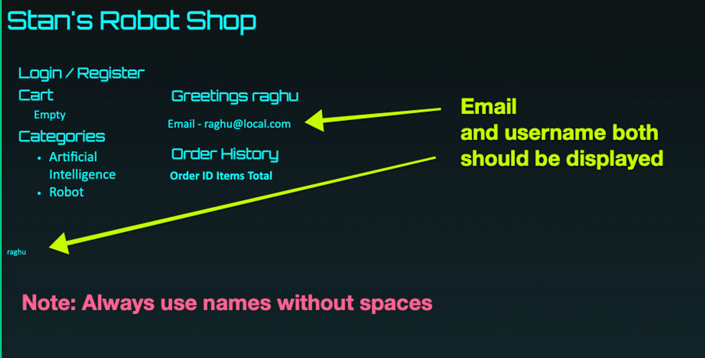
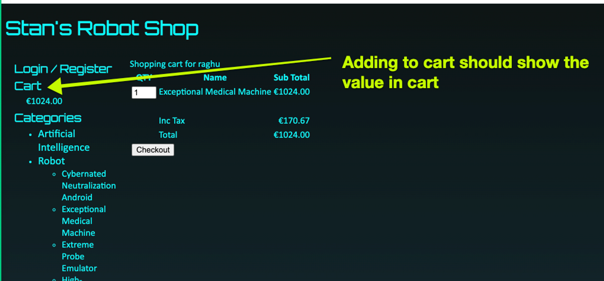
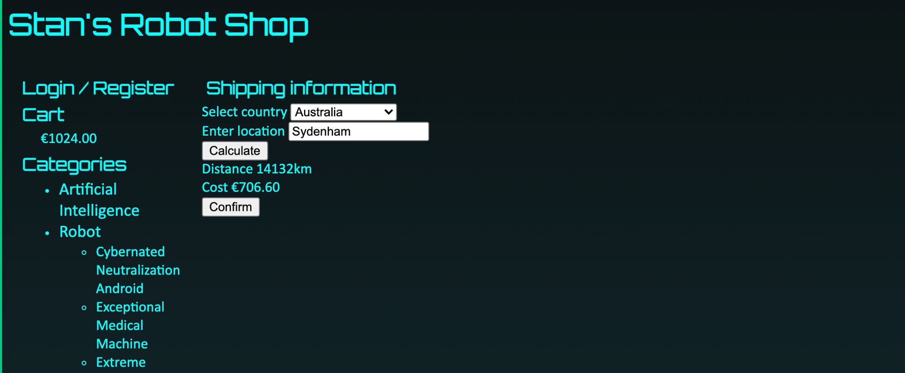
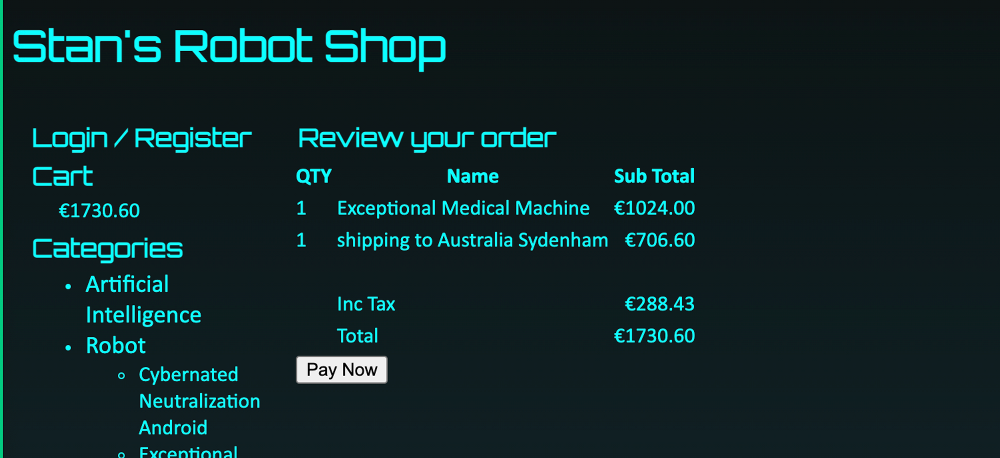
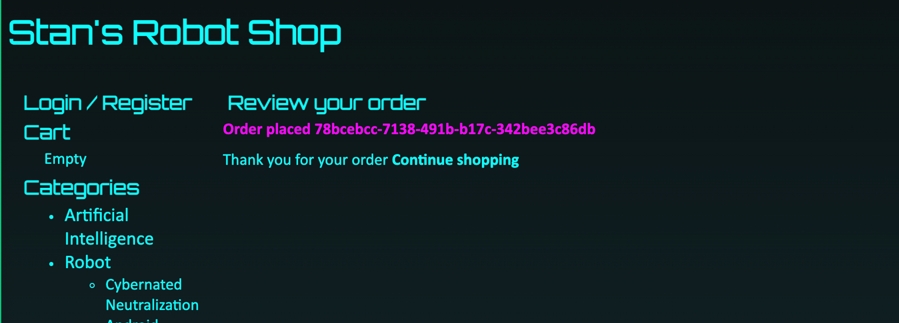
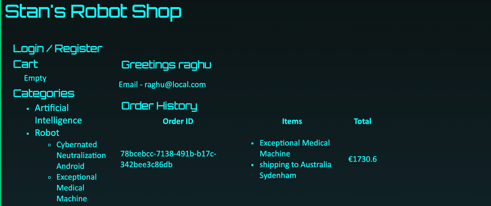

Project is having the following components.

The following screenshots help us to understand whether our app is working or not after the setup is done.

1. When we open roboshop landing page we should see list of categories.

2. I should be able to register and after registration, it should show the registered user information.

3. Going to categories and any product we should be able to add to cart.

4. Post checkout it should show countries.

Post that confirm also should show that final amount

5. Pay now should show that payment is done along with order id

By clicking on Login back it show the order history.

